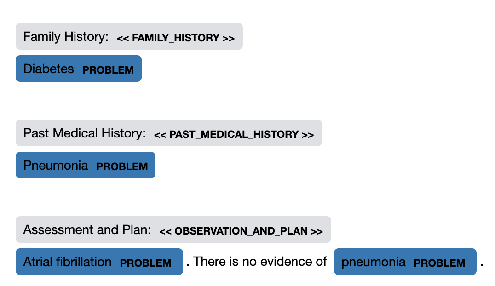

# Clinical Sectionizer
This package offers a component for tagging clinical section titles in docs. There are two different flavors of the sectionizer:
- `Sectionizer`: A spaCy component which is run on a `Doc` object and adds attributes to spaCy objects. This can be added
to an NLP pipeline and be executed as part of `nlp(text)`
- `TextSectionizer`: A stand-alone object, independent of spaCy which takes a text and returns a list of tuples, where
each tuple corresponds to a section in the text.

The `sectionizer` takes a list of 
patterns for section titles and searches for matches in a `doc`. When a section is found, it generates three outputs:
1. `section_title`: The normalized name of a section, a `string`
2. `section_header`: The span of the doc containing the header, a `Span`
3. `section_span`: The entire span of the doc containing the section, a `Span`

When using the spaCy `Sectionizer`, calling `sectionizer(doc)` adds the 
following extensions to spaCy objects:

- `Doc.sections`: A list of 3-tuples of (`name`, `header`, `section`)
- `Token.section_span`: The `span` of the entire section which the token occurs in
- `Token.section_header`: The `span` of the section header of the section a token occurs in
- `Token.section_title`: The name of the section header defined by a pattern
- `Span` attributes corresponding `section_span`, `section_header`, and `section_title` to the first token in a span

When using `TextSectionizer`, calling `sectionizer(text)` returns a list of 3-tuples which correspond to the outputs 
described above, but each as texts rather than spaCy objects: `(section_title, section_header, section_text)`

# Installation
You can install `clinical_sectionizer` via pip:
`pip install clinical-sectionizer`

Or by cloning this repository and running:
`python setup.py install`

# Example
See `notebooks/`for more detailed examples.

```python
>>> text = """Family History:
    Diabetes
    
    Past Medical History:
    Pneumonia
    
    Assessment and Plan:
    Atrial fibrillation. There is no evidence of pneumonia.
    """
>>> import spacy
>>> nlp = spacy.load(...) # Load a model which will match clinical concepts

>>> from clinical_sectionizer import Sectionizer
>>> sectionizer = nlp.add_pipe(Sectionizer(nlp))


>>> section_patterns = [
        {"section_title": "family_history", "pattern": "Family History:"},
        {"section_title": "past_medical_history", 
            "pattern": [
                {"LOWER": "past", "OP": "?"}, 
                {"LOWER": "medical"},
                {"LOWER": "history"}, 
                {"LOWER": ":"},
            ]
            
        },
        {"section_title": "assessment_and_plan", "pattern": "Assessment and Plan:"},
    ]
>>> sectionizer.add(section_patterns)

>>> nlp.add_pipe(sectionizer)
>>> doc = nlp(text)
>>> print(nlp.ents)
(Diabetes, Pneumonia, Atrial fibrillation, pneumonia)


>>> for (section_name, section_header, section) in doc._.sections:
        print(section_name, section_header, section, sep="\n")

family_history
Family History:
Family History:
Diabetes

past_medical_history
Past Medical History:
Past Medical History:
Pneumonia

assessment_and_plan
Assessment and Plan:
Assessment and Plan:
Atrial fibrillation. There is no evidence of pneumonia.

>>> for ent in doc.ents:
        print(ent, ent._.section_title)
    
Diabetes family_history
Pneumonia past_medical_history
Atrial fibrillation assessment_and_plan
pneumonia assessment_and_plan
```

Using [cycontext](https://github.com/medspacy/cycontext), you can also use a visualizer which shows section headers, along with any extracted entities and 
optionally cycontext modifiers, in an NER-style visualization.
```python
from cycontext.viz import visualize_ent
visualize_ent(doc, sections=True, context=False)
``` 
<p align="center"></p>
